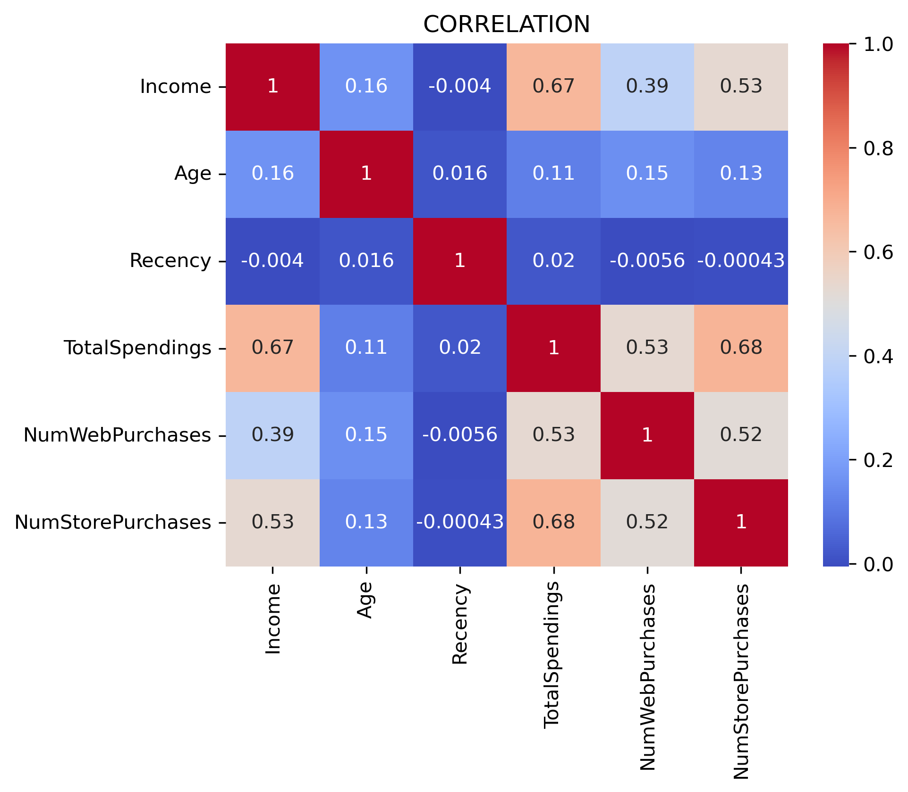
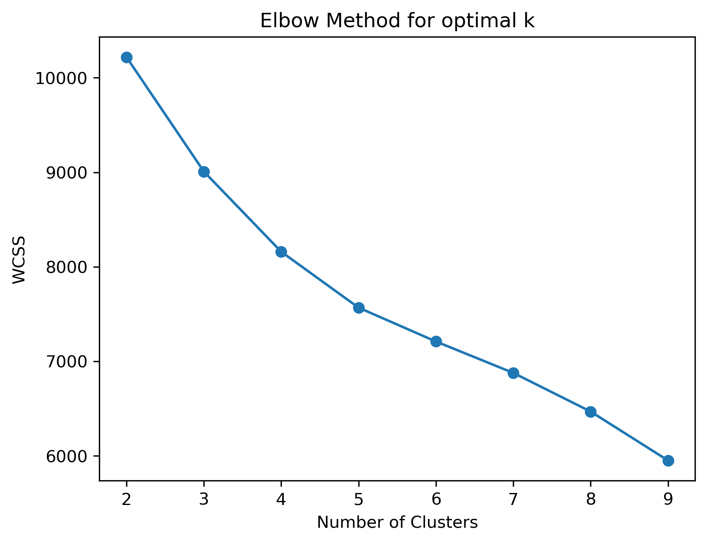
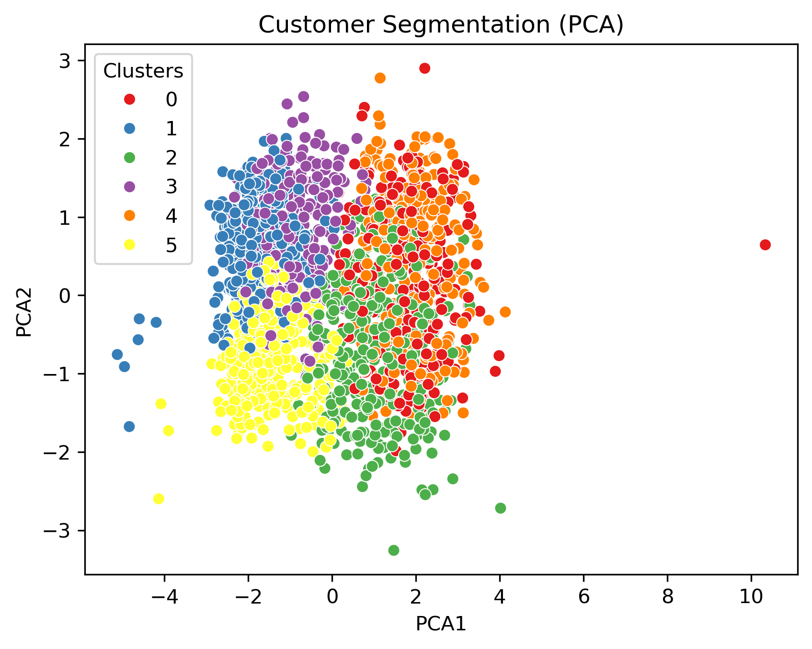

# 👥 Customer Segmentation using K-Means Clustering

An end-to-end machine learning project that applies **K-Means clustering** to segment customers based on their demographic characteristics, income, spending behavior, purchase recency, and shopping channel activity. The project demonstrates how unsupervised machine learning can uncover distinct customer profiles and generate actionable insights for targeted marketing strategies.

## 📌 Project Overview

Understanding customer behavior is essential for businesses looking to improve marketing effectiveness, customer retention, and revenue generation.

This project uses **K-Means clustering** to group customers with similar characteristics and purchasing behaviors into distinct segments.

The analysis considers factors such as income, spending, purchase frequency, recency, website activity, and in-store activity to identify meaningful customer profiles.

The project includes data preprocessing, feature scaling, exploratory data analysis, cluster optimization using the Elbow Method, K-Means clustering, dimensionality reduction using PCA, and customer segment profiling.

## ✨ Features

📊 Exploratory Data Analysis (EDA)
🧹 Data cleaning and preprocessing
⚙️ Feature selection and preparation
📏 Feature scaling using StandardScaler
📉 Correlation analysis
📐 Elbow Method for determining optimal clusters
🤖 K-Means clustering
🔬 PCA-based cluster visualization
👥 Customer segment profiling
📈 Behavioral and demographic analysis
💡 Actionable business insights

## 🛠️ Technologies Used

* Python
* Pandas
* NumPy
* Scikit-learn
* Matplotlib
* Seaborn
* Jupyter Notebook
* Google Colab

## 📂 Project Structure

```text
customer-segmentation-machinelearning/
│
├── customer_segmentation.ipynb
├── dataset.csv
├── correlation_heatmap.png
├── elbow_method.png
├── customer_segmentation_pca.png
├── requirements.txt
└── README.md
```

## 📊 Visualizations

### 🔥 Correlation Heatmap

The correlation heatmap highlights relationships between the numerical variables used in the analysis, helping identify patterns and dependencies within customer demographic and behavioral data.



### 📉 Elbow Method

The Elbow Method was used to evaluate different values of **K** and determine an appropriate number of customer segments.

The analysis identified **6 clusters** as the optimal configuration for the K-Means model.



### 👥 Customer Segmentation using PCA

Principal Component Analysis (PCA) was used to reduce the dimensionality of the customer data and visualize the resulting customer segments in two dimensions.



## 📊 Dataset

The dataset contains customer records with demographic and behavioral information, including:

* Age
* Income
* Spending behavior
* Purchase frequency
* Purchase recency
* Website activity
* In-store activity
* Shopping channel behavior

These variables were used to identify groups of customers with similar characteristics and purchasing patterns.

## ⚙️ Machine Learning Workflow

1. Import and explore the customer dataset
2. Clean and preprocess the data
3. Select relevant demographic and behavioral features
4. Analyze feature relationships using a correlation matrix
5. Standardize features using `StandardScaler`
6. Apply the Elbow Method to determine the optimal number of clusters
7. Train the K-Means clustering algorithm
8. Assign customers to their respective clusters
9. Apply PCA for dimensionality reduction
10. Visualize the customer segments
11. Profile each cluster based on customer characteristics
12. Identify actionable business insights

## 🤖 Clustering Model

The project uses **K-Means clustering**, an unsupervised machine learning algorithm that groups data points into clusters based on their similarity.

After evaluating different values of K using the Elbow Method, the final model was configured with:

**Number of Clusters (K): 6**

Each customer was assigned to one of six distinct segments based on their demographic and purchasing behavior.

## 👥 Customer Segments

| Cluster | Segment                               | Characteristics                                                                           |
| ------- | ------------------------------------- | ----------------------------------------------------------------------------------------- |
| 0       | **Loyal High-Value Customers**        | High income, high spending, frequent online and in-store purchases, average recency       |
| 1       | **Conservative Traditional Shoppers** | Oldest customers, moderate income, low spending, and few purchases                        |
| 2       | **Premium Active Customers**          | High income, highest spending, very recent purchases, and few website visits              |
| 3       | **At-Risk Premium Customers**         | High income, very high spending, but a long time since their last purchase                |
| 4       | **Inactive Budget Customers**         | Lower income, low spending, infrequent purchases, and low recent activity                 |
| 5       | **Price-Conscious Browsers**          | Youngest customers, lowest income and spending, frequent website visits but few purchases |

## 💡 Key Business Insight

The analysis identified an important opportunity among **At-Risk Premium Customers (Cluster 3)**.

Although these customers have high income and very high historical spending, their long purchase recency suggests that they may be disengaging.

A targeted **re-engagement campaign**, personalized offers, loyalty incentives, or product recommendations could potentially reactivate these previously high-value customers.

At the same time, **Premium Active Customers (Cluster 2)** represent an important group to retain because they combine high income, very high spending, and recent purchasing activity.

## 📈 Results

The K-Means model successfully identified **six distinct customer segments** with meaningful differences in:

* Income
* Spending behavior
* Purchase frequency
* Purchase recency
* Website activity
* In-store activity
* Customer age

The resulting segmentation provides a foundation for developing differentiated marketing strategies rather than treating all customers in the same way.

## 🚀 Installation

Clone the repository:

```bash
git clone https://github.com/maliksubhanameerali/customer-segmentation-machinelearning.git
```

Navigate into the project directory:

```bash
cd customer-segmentation-machinelearning
```

Install the required libraries:

```bash
pip install -r requirements.txt
```

## ▶️ Run the Project

Launch Jupyter Notebook:

```bash
jupyter notebook
```

Then open the project notebook and run the cells sequentially.

## 🔮 Future Improvements

* Experiment with alternative clustering algorithms such as DBSCAN and hierarchical clustering
* Compare different clustering evaluation metrics
* Calculate Silhouette Score and Davies-Bouldin Index
* Develop an interactive customer segmentation dashboard
* Add automated customer profiling
* Integrate customer segments into marketing campaigns
* Build a recommendation system based on customer segments
* Deploy the segmentation model as an interactive web application
* Analyze segment changes over time

## 📚 Learning Outcomes

This project strengthened my understanding of:

* Unsupervised machine learning
* K-Means clustering
* Feature scaling
* Exploratory Data Analysis
* Correlation analysis
* Cluster optimization
* The Elbow Method
* Principal Component Analysis (PCA)
* Customer profiling
* Data visualization
* Business-oriented machine learning
* Translating machine learning results into actionable insights

## 👨‍💻 Author

**Malik Subhan Ameer Ali**

**GitHub:** https://github.com/maliksubhanameerali

**LinkedIn:** https://www.linkedin.com/in/malik-subhan-ameer-ali-3b0061416
